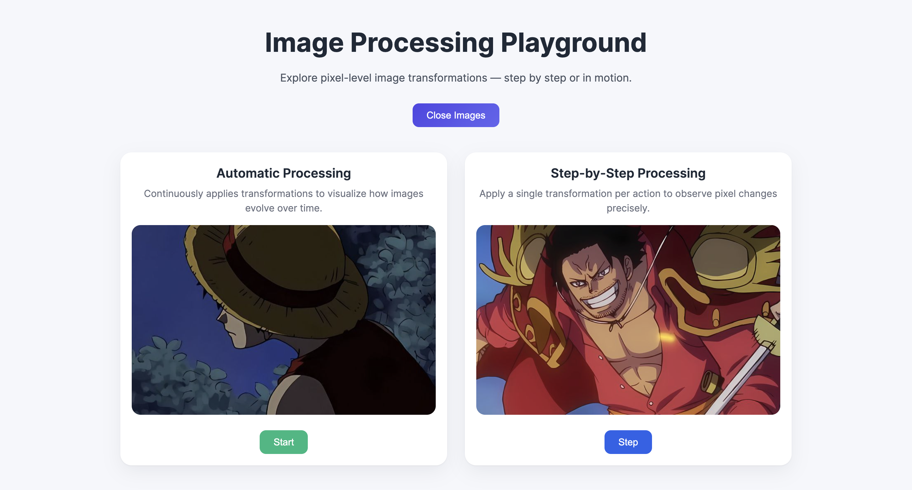
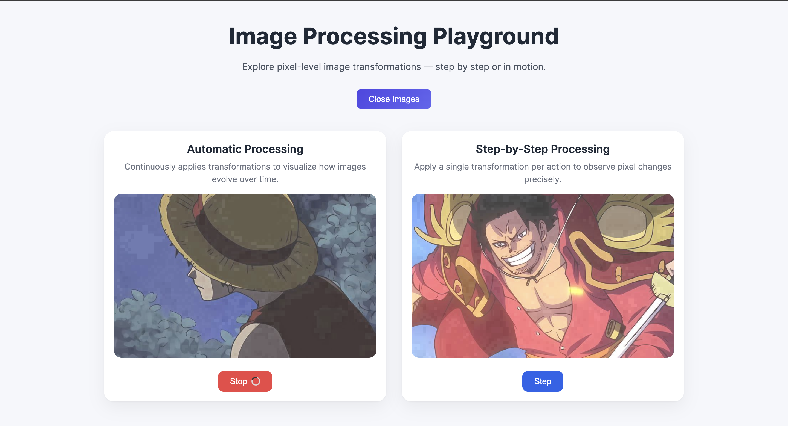

# Image Processing Playground 

A simple web app that demonstrates **incremental image processing** using ASP.NET Razor Pages and **SixLabors.ImageSharp**.

The goal is to visualize pixel-level changes step by step or automatically,
with **minimal logic and clean flow**.

---

## ✨ Features

- Incremental brightness processing (+ small step each time)
- Step-by-step image update
- Automatic processing (Start / Stop)
- Loading animation during auto mode
- Simple UI with clear controls
- Minimal, easy-to-follow logic

---

## 🧠 How It Works

- **Step Image**  
  Applies one incremental change per click.

- **Auto Image**  
  Applies the same incremental change repeatedly on a timer.

---

## 📸 Screenshots

### Main Interface

### Step-by-Step Processing

### Auto Processing with Loader

---

## 🚀 Getting Started

1. Clone the repo
2. Restore packages
3. Run the project
4. Open the app in your browser
5. Click **Open Images**
6. Use **Step** or **Start** to process images
